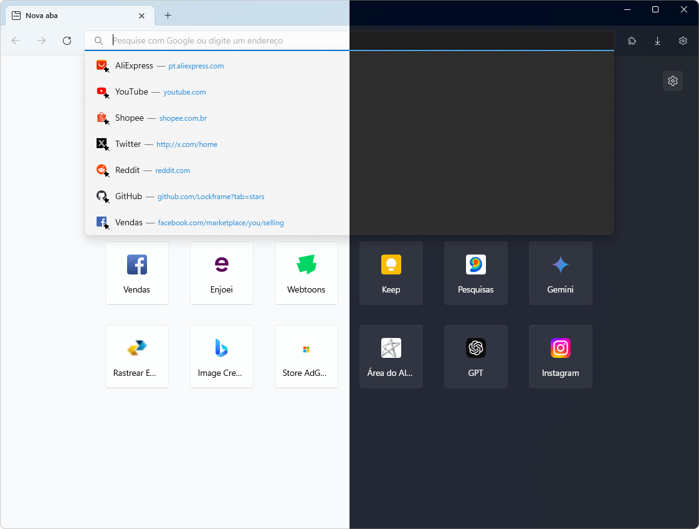

# Firefox-WinUI
A custom CSS addon for [bmFtZQ](https://github.com/bmFtZQ)'s [Edge-frfx](https://github.com/bmFtZQ/Edge-FrFox) theme with some [tweaks by MrOtherGuy](https://github.com/MrOtherGuy/firefox-csshacks) to make it look more inline with Windows 11's design.

<!-- Use  element to set a maximum width. -->

## How to install
1. Go to your Firefox profile's chrome folder after installing Edge-frfx and optionally make a backup of the original `userContent.css`.
2. Download the `icons` folder, `custom.css` and `userContent.css` from this repository and add them to your Firefox profile's `chrome` folder.
3. Close and restart Firefox, if performed correctly, the theme should now be installed.
4. Go to `about:config` and set the following boolean keys to true:
* `browser.tabs.allow_transparent_browser`
* `widget.transparent-windows`
* `widget.windows.mica`
5. Create and set the following boolean keys to false:
* `uc.tweak.disable-drag-space`
* `uc.tweak.floating-tabs`
* `uc.tweak.force-tab-colour`
* `uc.tweak.newtab-background`
* `uc.tweak.remove-tab-separators`
* `uc.tweak.revert-context-menu`
* `uc.tweak.rounded-corners`

You can also add the following boolean keys to enable some tweaks:
* `uc.winui.aptos`
* `uc.winui.centered-url`
* `uc.winui.extra-acrylic`
* `uc.winui.extra-animations`
* `uc.winui.extra-highlights`
* `uc.winui.floating-tabs`
* `uc.winui.grayer-tabbed`
* `uc.winui.hide-with-1-tab`
* `uc.winui.immersive-navbar`
* `uc.winui.mac-back-forward`
* `uc.winui.more-acrylic`
* `uc.winui.navbar-highlights`
* `uc.winui.pill-urlbar`
* `uc.winui.rounded-corners`
* `uc.winui.rounded-navbar`
* `uc.winui.smaller-toolbar-buttons`
* `uc.winui.taller-urlbar`
* `uc.winui.transparent-urlbar`
* `uc.winui.uppercase-newtab-label`
* `uc.winui.urlbar-extra-separators`
